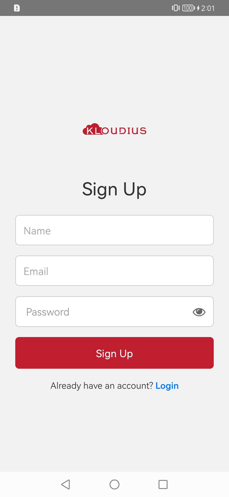
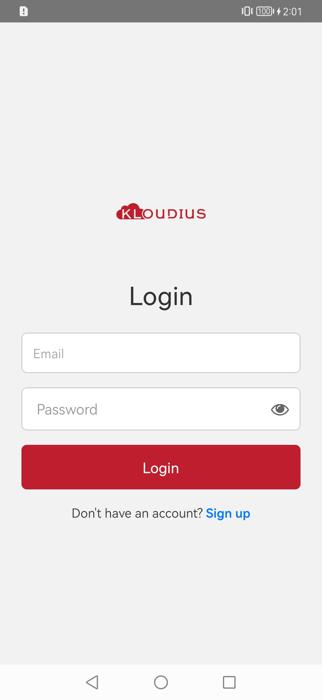
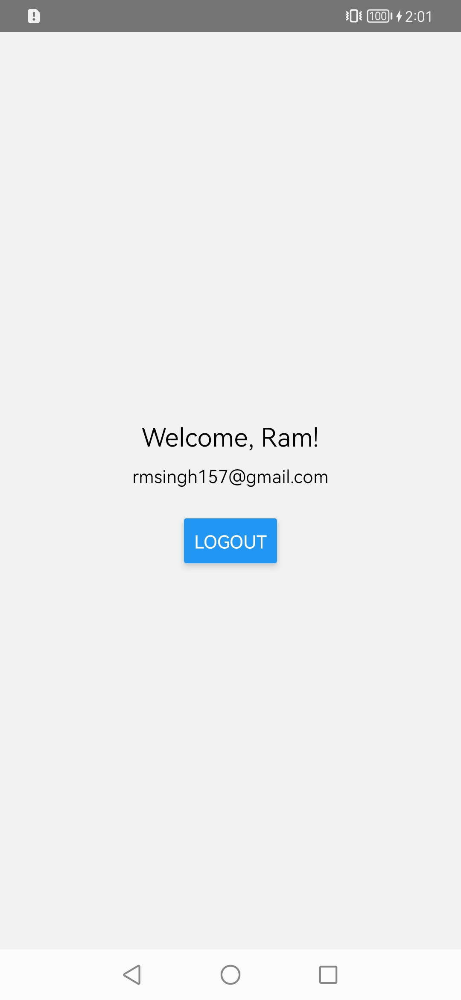

# Kloudius Auth App

A React Native app demonstrating Login/Signup functionality using React Context API, form validation, and persistent authentication with AsyncStorage.

## 📱 Features

- 🔐 **User Authentication** (Login & Signup)
- 🌐 **Global Auth State** with React Context API
- 🧪 **Form Validation**
  - Email format
  - Required fields
  - Password length (min 6 characters)
- 💾 **Persistent Login** with AsyncStorage (optional)
- 👁️ **Password Visibility Toggle**
- 🔄 **Navigation** with React Navigation
  - Login → Signup → Home screens
- 🚪 **Logout Functionality**
- 🎨 Clean & user-friendly UI

## 📂 Screens

### 🔑 Login Screen
- Email and Password input fields
- "Login" button that triggers `login()` from `AuthContext`
- Error messages for:
  - Invalid email/password
  - Wrong credentials
- Navigation to Signup screen

### 📝 Signup Screen
- Name, Email, and Password input fields
- "Signup" button that triggers `signup()` from `AuthContext`
- Validation for:
  - Required fields
  - Valid email
  - Password length (≥ 6)
- Navigation back to Login screen

### 🏠 Home Screen
- Displays current user's **name** and **email**
- "Logout" button to log out and return to login

## 🚀 Getting Started

### Prerequisites
- Node.js ≥ 14.x
- Yarn
- React Native CLI
- Android Studio or Xcode (for device/simulator)

### Installation

1. Clone the repo:
   ```bash
   git clone https://github.com/ramsingh007/KloudiusAuthApp

   cd KloudiusAuthApp

2. Install dependencies.

```js
yarn install
```

3. Run project on iOS / Android.

```js
 yarn android  //for android
 yarn ios  //for ios
```
## 📸 Screenshots

### 🔐 Signup Screen




### 🔐 Login Screen



### 🔐 Dashboard Screen



